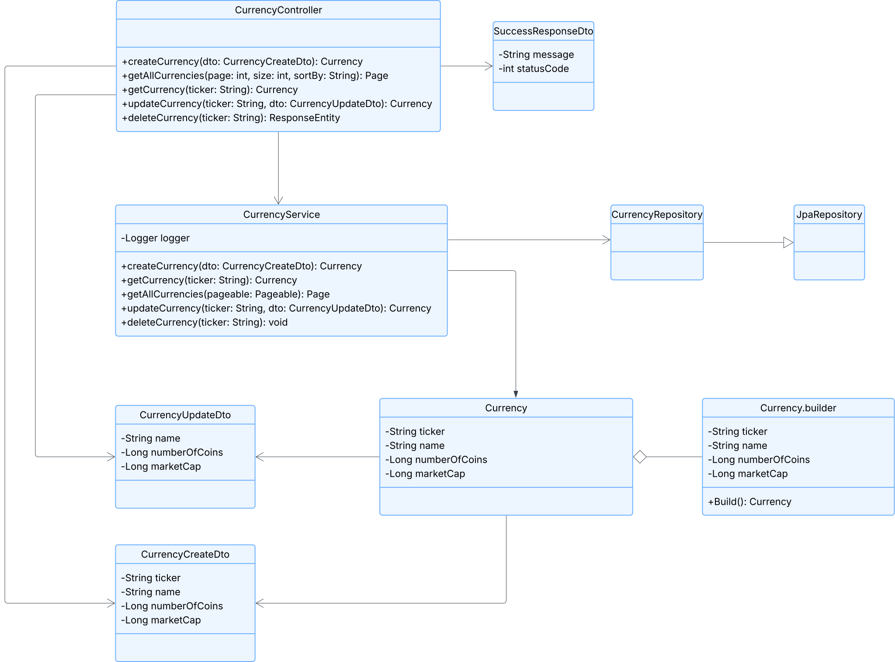

# Crypto API

Dit is een implementatie van de crypto API opdracht.
Hierbij is er een API gemaakt in Java Spring, waar er CRUD functionaliteit is voor het beheren van crypto munten.
De volgende paden zijn bij deze applicatie bereikbaar:

| HTTP Methode | Endpoint                     | Omschrijving                   |
|--------------|------------------------------|--------------------------------|
| POST         | /api/currencies              | Creëert een nieuw record       |
| GET          | /api/currencies/[identifier] | Haalt een specifiek record op  |
| GET          | /api/currencies              | Haalt een lijst met records op |
| PUT          | /api/currencies/[identifier] | Update een specifiek record    |
| DELETE       | /api/currencies/[identifier] | Delete een specifiek record    |

In deze paden wordt ticker gebruikt als identifier en is er ondersteuning voor pagination en sorting, op de get all currencies route.
Voor deze routes is ook een postman collectie opgesteld, dit is het [Pharmapartners.postman_collection.json](Pharmapartners.postman_collection.json) bestand.

## UML diagram
In het volgende diagram is te zien welke klassen er met elkaar verbonden zijn, en welke functie deze bevatten.

